# Liberty Getting Started

## data collection, assessments, & deployment accelerators

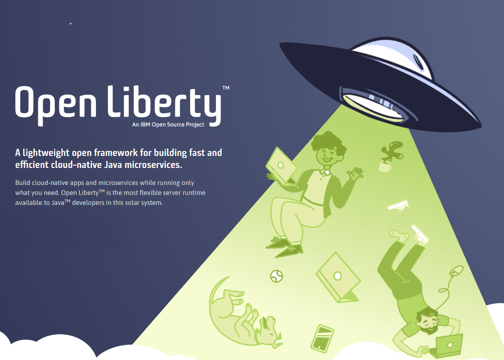 

**Last updated:** March 2024

**Duration:** 90 minutes

Need support? Contact **Lars Besselmann, Kevin Postreich**

## Liberty Getting Started tasks

**Liberty** is a lightweight open framework for building fast and efficient cloud-native Java microservices. Build cloud-native apps and microservices while running only what you need. It is the most flexible server runtime available to Java developers in this solar system.

* Open Liberty is designed with both developers and application business owners in mind.
    * It delivers the latest Java APIs and integrates with the most popular Developer and Build tools.
    * It has built-in innovation like zero-migration to reduce application runtime costs and delivery effort.
    * WebSphere Liberty is downstream of Open Liberty so anything that works on Open Liberty works on WebSphere Liberty.
    * Same Monthly Continuous Delivery Release Cycle as WebSphere Liberty
    * You do not need to switch to WebSphere Liberty for commercial support

**Liberty Tools** is a set of intuitive developer tools for the Eclipse IDE, Visual Studio Code, and IntelliJ IDEA development environments. These tools adopt a Maven/Gradle-centric approach and enable fast, iterative cloud-native Java application development through Liberty dev mode.
Liberty Tools also provides helpful, time-saving features such as code completion, hover descriptions, and configuration diagnostics for Jakarta EE APIs, MicroProfile APIs, and Liberty configuration. For more information, check out the Liberty Tools overview.

## 1. Introduction

In the lab, there will be different roles involved with perform different tasks using different tools. You will perform all the different roles during the lab. 

* You will start as an application developer and use Liberty starter and the code assistant to develop a simple web application. But don't worry, you do not have to be a developer to do this.

* As Liberty configuration developer, You will use the configuration assistant and concepts like includes and variables to create a portable configuration. 

* As Liberty administrator, you will install Liberty from a kernel image, add missing features, configure loging, security and so on, will use the Liberty REST APIs to review the configuration and use Liberty Admin Center for monitoring.

## 2. Objective

These are the objectives in the lab:

* As application developer:
    * Tasks: 
        * Develops the application.
        * Creates a basic Liberty configuration for the application
    * Tools:
        * Apache Maven 
            * to build the project 
            * to download the Open Liberty server runtime from the maven repository
        * Liberty Maven Plugin for inner-loop development via Liberty Dev Mode
            * to build the application war and deploy it to Liberty
        * Visual Studio Code 
            * as IDE to build the application code
        * Liberty Tools plugin for Visual Studio Code
            * provides a Liberty dashboard with Dev Mode integration in the IDE
            * provides Jakarta EE and MicroProfile code assistance
            * provides Liberty configuration assistance
        * Liberty Starter Project 
            * to generate a maven project for Liberty 
        * Open Liberty / WebSphere Liberty
            * as runtime for the Java application that will be developed
            * to create a server package

* As Liberty configuration developer:
    * Tasks: 
        * Develop portable Liberty configuration snippets using includes, variables and much more.
    * Tools:
        * Visual Studio Code with Liberty Tools plugin as editor with configuration assistance

* As Liberty administrator:
    * Tasks: 
        * Installs Liberty
        * Configures Liberty for the target application using Liberty configuration snippets
        * Applies security to harden the Liberty configuration
        * Configure logging using configDropins
        * Review the configuration using LIberty REST APIs
        * Monitor Liberty using the Admin Center
    * Tools:
        * Liberty server command to create a Liberty instance and start, stop or dump it
        * Liberty installUtility to install missing features
        * Liberty securityUtility to create a keystore or encode a password
        * Liberty REST APIs and Admin Center

 

## 3. Prerequisites

The following prerequisites must be completed prior to beginning this
lab:

  - Familiarity with basic Linux commands

  - Have internet access

  - Have a lab environment ready

 

## 4. Accessing the environment

If you are doing this lab as part of an instructor led workshop (virtual or face to face), an environment has already been provisioned for you. The instructor will provide the details for accessing the lab environment.

Otherwise, you will need to reserve an environment for the lab. You can obtain one here. Follow the on-screen instructions for the “**Reserve now**” option.

<https://TBD-to-the-reservation-link>

The lab environment contains one (1) Linux VM, named Workstation.

<kbd>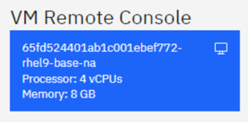</kbd>

 

1.  Access the lab environment from your web browser. 
     
    A `Published Service` is configured to provide access to the **`Workstation`** VM through the noVNC interface for the lab environment.
    
    a. When the demo environment is provisioned, click on the **`environment tile`** to open its details view. 

    b. Click on the **`Published Service`** link which will display a **Directory listing**  
    
    c. Click on the **`vnc.html`** link to open the lab environment through the **noVNC** interface. 
    
    <kbd></kbd>
    
    d. Click the **`Connect`** button 
    
      <kbd></kbd>

    e. Enter the password as:  **`passw0rd`**. Then click the **`Send Credentials`** button to access the lab environment. 

    > Note: That is a numeric zero in passw0rd  

      <kbd></kbd>

	 
	  
	 
2.  If prompted to Login to the "workstation" VM, use the credetials below: 

    The login credentials for the **workstation”** VM is:
 
     - User ID: **techzone**

     - Password: **IBMDem0s!**

     > Note: That is a numneric zero in the password

	  
 
     <kbd></kbd>
	 
	  

## 5. Tips for working in the lab environment     

1. You can resize the viewable area using the **noVNC Settings** options to resize the virtual desktop to fit your screen.

    a. From the environemnt VM, click on the **twisty** on the noNC control pane to open the menu.  

    <kbd></kbd>

    b. To increase the visible area, click on `Settings > Scaling Mode` and set the value to `Remote Resizing`
      
     <kbd></kbd>

2.  You can copy / paste text from the lab guide into the lab environment using the clipboard in the noVNC viewer. 
   
    a. Copy the text from the lab guide that you want to paste into the lab environment
    
    b. Click the **`Clipboard`** icon and **`paste`** the text into the noVNC clipboard

    <kbd></kbd>
    
    c. Paste the text into the VM, such as to a terminal window, browser window, etc. 

    d. Click on the **`clipboard`** icon again to close the clipboard

   
3. An alternative to using the noVNC Copy / Paste option, you may consider opening the lab guide in a web browser inside of the VM. Using this method, you can easily copy / paste text from the lab guide without having to use the noVNC clipboard. 

4. To switch between different windows or get access the tool bar, click on the **`Activities`** icon within the VM.

    <kbd></kbd>

    Then select from the tool bar the application that you want to open. In the lab, you will use Firefox and the terminal.

    <kbd>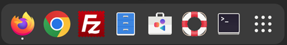</kbd>
    

5. How to change the background color 
In the environment, the default background for terminal windows and Visual Studio Code is dark. For the lab documentation, we changed the color to light. Feel free to keep the background in light but if you want to change it to dark, here the explanation how it was changed.

    1. How to change the terminal background to white
        Right-click into the terminal background, then select Preferences.

        <kbd>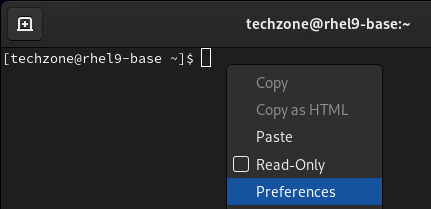</kbd>

        A Preferences window opens. Click on Colors, then uncheck the box for  Use colors from system theme . (If you want to get back to dark, check the box again).

        <kbd>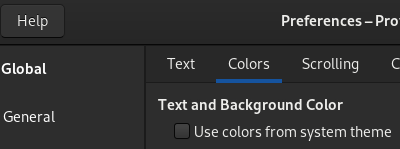</kbd>

        The terminal background should switch to white.

        <kbd>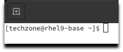</kbd>

        Close the Preferences window.

    2. How to switch the background of Visual Studio Code from dark to light

        In a terminal Window, run the following command to start Visual Studio Code

            mkdir ~/temp
            code ~/temp

        <kbd>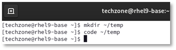</kbd>

        Visual Studio Code opens with a dark background. 
        Click on  Yes, I trust the authors 

        <kbd>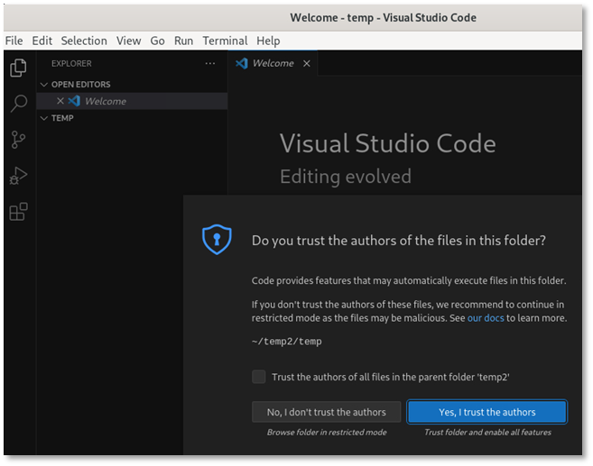</kbd>

        Then select Preferences > Theme > Color Theme

        <kbd>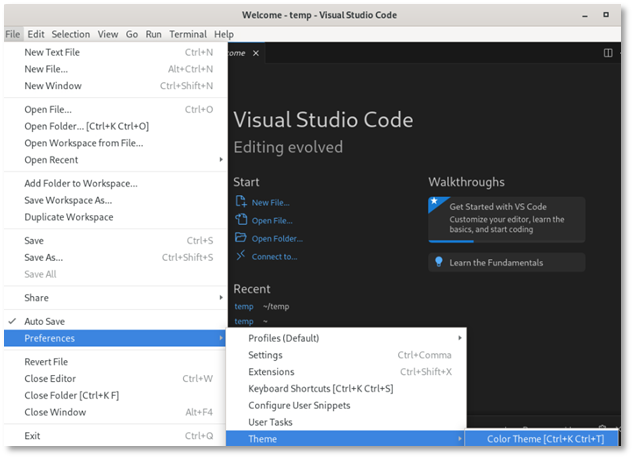</kbd>

        Select Light

        <kbd>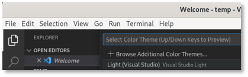</kbd>

        The tool will change to a light background, see below.

        <kbd>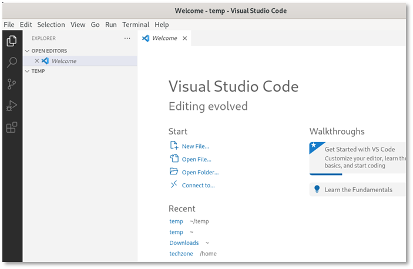</kbd>

        Close Visual Studio Code.

     

## 6. Execute Lab Tasks

### 6.1 Verify the installed software 

Open a terminal by clicking on Activities and selecting terminal.

<kbd>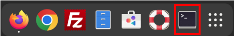</kbd>

The terminal window opens.

<kbd>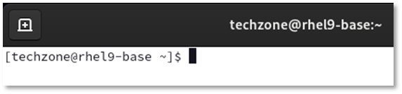</kbd>

Check the Maven version via the following command:

    mvn -version

<kbd>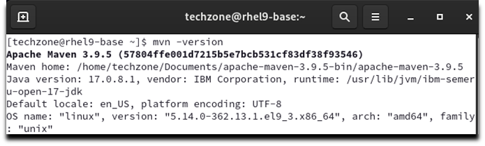</kbd>

Check the Docker version via the following command:

    docker -v

<kbd>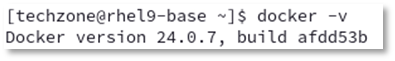</kbd>

Check the Git version via the following command:

    git -v

<kbd></kbd>

### 6.2 Create the required working directories

Create the Student directories and some sub-directories used in the lab:

    mkdir ~/Student
    mkdir ~/Student/dev
    mkdir ~/Student/ops
    mkdir ~/Student/assets

### 6.3 Develop a Liberty web application

Target of the section is to develop a simple web application for Liberty. You will use a **Liberty starter application** to now start from scratch and use Visual Studio Code and Liberty Tools to build the application.

### 6.3.1 Create a starter app project.

In this scenario, you want to create a Jakarta EE 10 Web application with the name „simpleweb“ and will use maven to build it. The fastest way to get started is to use an Open Liberty starter application which generates a project with the maven configuration as well as a basic Liberty setup.

<kbd>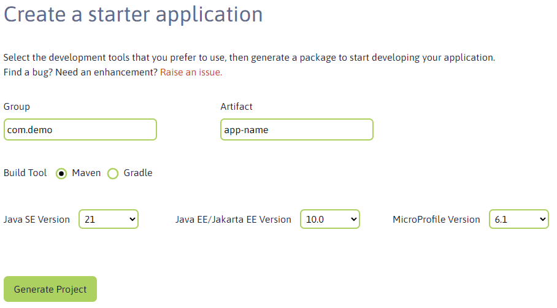</kbd>

The **Open Liberty starter** gives you a simple, quick way to get the necessary files to start building an application on Open Liberty. There is no need to search how to find out what to add to your maven or gradle build files. A simple RestApplication.java file is generated for you to start creating a REST based application. A server.xml configuration file is provided with the necessary features for the MicroProfile and Jakarta EE versions that you previously selected. 

1. Open a browser window by clicking on **Activities** and then select the **Firefox** browser icon.

<kbd>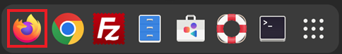</kbd>

If you get a pop-up that Authentication is required, enter  IBMDem0s! 

<kbd></kbd>

2. Enter the URL https://openliberty.io/start/

| <kbd></kbd> | If the page does not open, close the browser and open it again. |

3. Change the artifact name to **simpleweb**, change the Java level to **17** and leave the rest as is, then click on **Generate project** 

<kbd></kbd>

4. Click on **Save** to save the project under Downloads.

<kbd>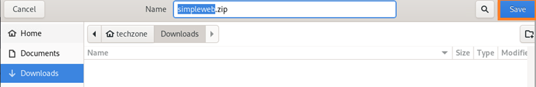</kbd>

You will see a pop-up like the one below. Click on **Got it!**  to close the window.

<kbd>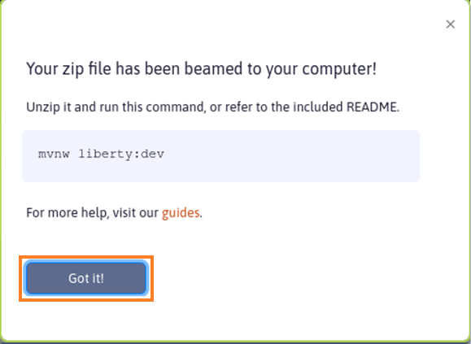</kbd>

5. Extract the file

Click on **Activities** and switch to the terminal window. Move the starter project to the developer directory and extract it:

    mv ~/Downloads/simpleweb.zip ~/Student/dev
    unzip ~/Student/dev/simpleweb.zip -d ~/Student/dev/simpleweb

<kbd>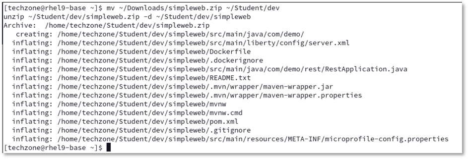</kbd>

The project has been created under ~/Student/dev/simpleweb. List the content via following command:

    ls -lrt ~/Student/dev/simpleweb

<kbd>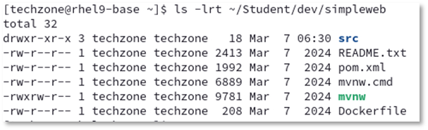</kbd>

### 6.3.2. Inspect the starter project using Open Visual Studio Code

Now you will use Visual Studio Code to see what has been generated as part of the starter project

1. From the terminal window, start Visual Studio Code

    cd ~/Student/dev/simpleweb/
    code .

<kbd>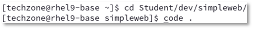</kbd>

Visual Studio Code will be opened.

<kbd>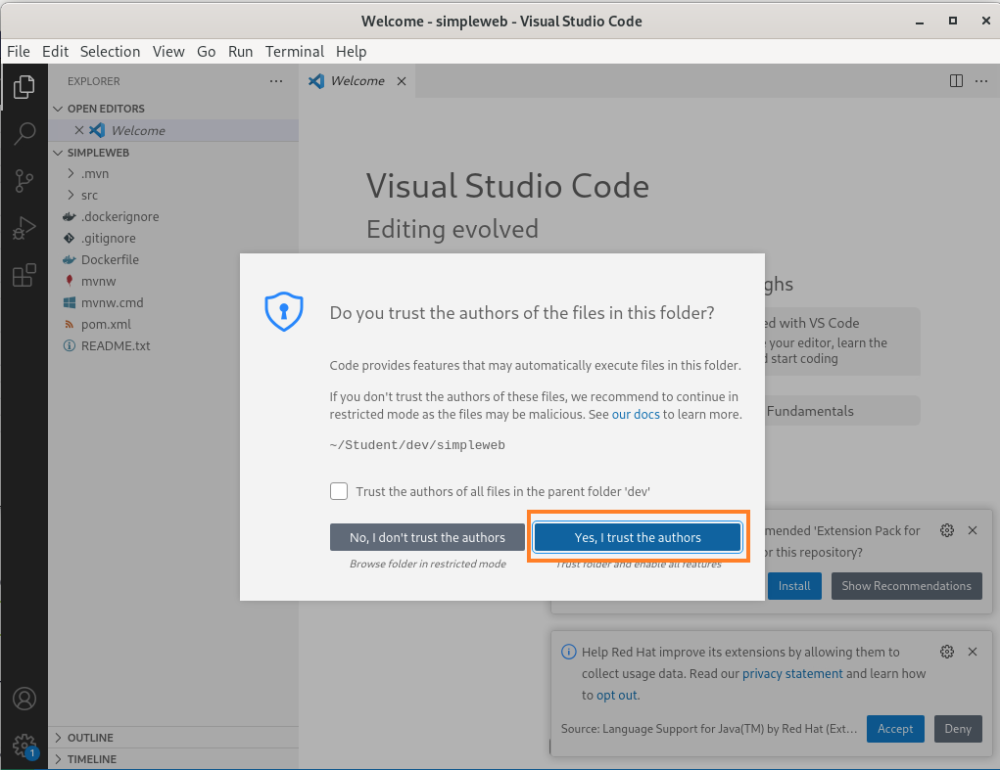</kbd>

Click on **Yes, I trust the authors**.

If you see during the lab one of the pop-ups below or any other pop-up asking to install something, close the pop-up without installation by clicking the X.
<kbd>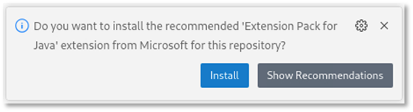</kbd>
<kbd>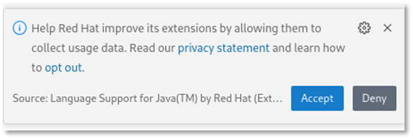</kbd>

2. Investigate into the generated project:

    In Visual Studio Code, take a look at the **Explorer** section to see the content of the project.
    You can find a src and a target folder, a Dockerfile and a maven build file (pom.xml).

    <kbd>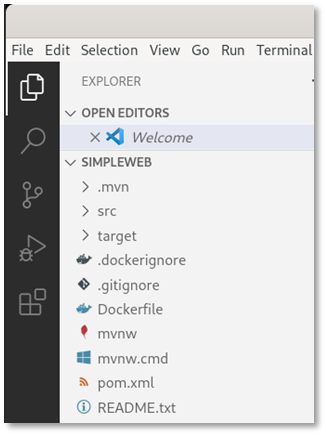</kbd>

3. Take a look at the generated Maven configuration 

    Click on **pom.xml** to see the maven pom.

    In the build section, you can find the configuration of the liberty-maven-plugin.

    <kbd>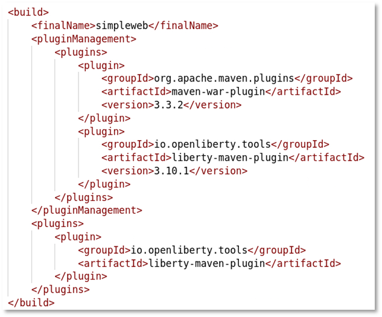</kbd>

    Don’t worry if the version of the plugin has changed to 3.10.2 or later.

    Finally close the pom.xml.

4. Review the generated Liberty configuration 
    Open src >  main >liberty > config > server.xml to see the Liberty configuration.

    <kbd>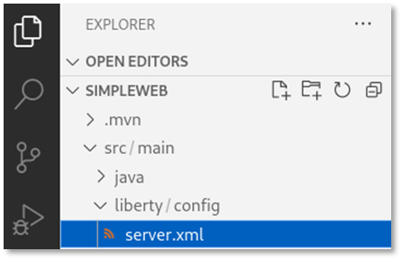</kbd>

    As you can see, the features for jakartaee-10 and MicroProfile-6.1 have been configured.

    <kbd>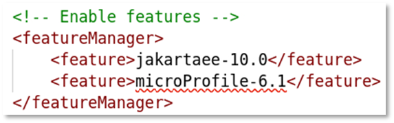</kbd>

    Scroll down and you can see that the http endpoint and the web application have been configured.

    <kbd>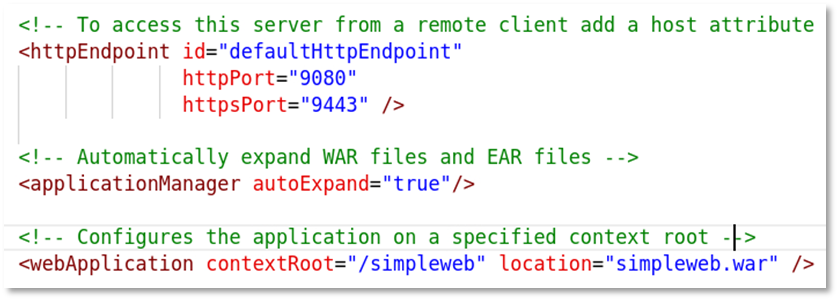</kbd>

    Don't close the server.xml file as you will modify it in teh next section.

### 6.3.3 Adjust the Liberty configuration

The application will not require the full Jakarta EE 10 standard but only the servlet specification.
As best practice to optimize the footprint of the application runtime regarding memory and disk space and limit the number of potential vulnerabilities, define only the features that are required by the application. In this case, replace the jakartaee-10 feature with an appropriate servlet feature. 

1. In the Visual Studio Code editor for server.xml, scroll up to the feature section.

2. Delete the lines **<feature>jakartaee-10.0</feature>** and **< feature>MicroProfile-6.1</feature>**.
    Your **featureManager** section should now look like this:

    <kbd>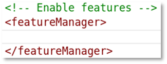</kbd>

3. Now you will use the **Liberty configuration assistant** to define the servlet feature. Place your cursor at the beginning of an empty line in the featureManager section. Then press the **CTRL key** and type **SPACE** to activate the configuration assistant. You should see something like:

    <kbd>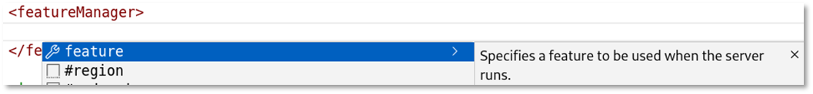</kbd>

    | <kbd></kbd> | You might have to click on the arrow right to feature to get the description. |

4. Select **feature** and the feature element gets added.

    <kbd>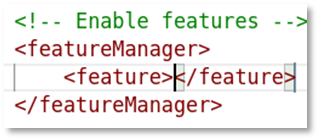</kbd>

5. Use again **CTRL+SPACE** to get the list of available features.

    <kbd>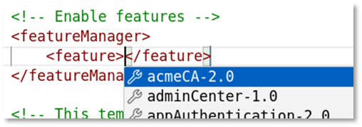</kbd>

6. Type the word **servlet** to see the available servlet features.

    <kbd>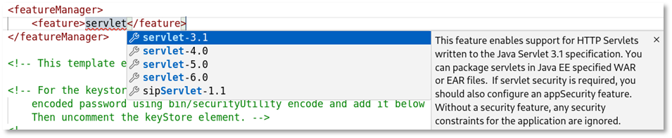</kbd>

7. Use the arrow-down key to get the description for servlet-6.0.

    <kbd>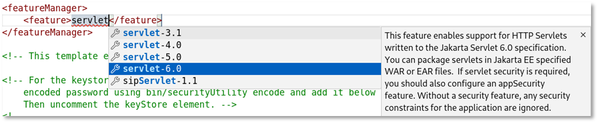</kbd>

8. Select the feature servlet-6.0 and your configuration should now look like this:

    <kbd>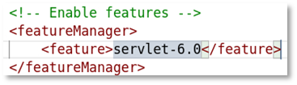</kbd>

9. For this part of the lab, we do not define a keystore or the basic registry, so delete the generated entries.
    Your configuration should now look like this:

    <kbd>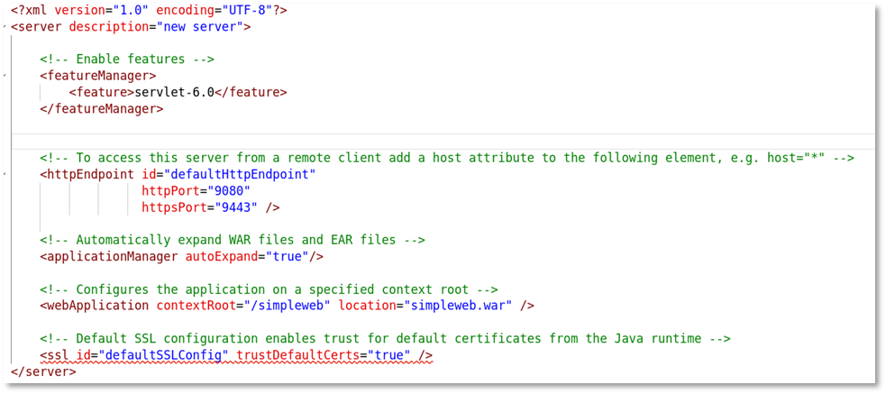</kbd>

10. Save the configuration by using CTRL+S.

11. Close the file server.xml.

### 6.3.4	Using Liberty Dev Mode

Liberty development mode, or dev mode, allows you to develop applications with any text editor or IDE by providing hot reload and deployment, on demand testing, and debugger support. Liberty Dev Mode is enabled through Maven and Gradle projects.

Your code is automatically compiled and deployed to your running server, making it easy to iterate on your changes.

You can run tests on demand or even automatically so that you can get immediate feedback on your changes. You can also attach a debugger at any time to debug your running application.

<kbd>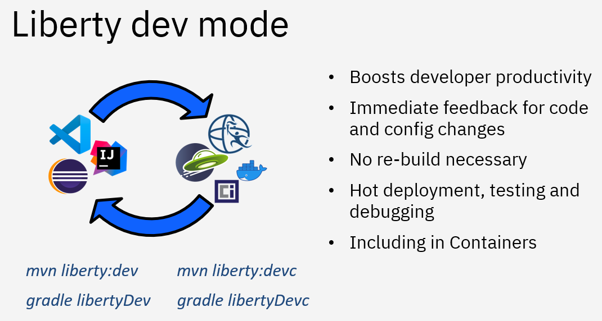</kbd>

You can use the capabilities of Liberty dev mode inside and outside of an IDE. This provides you the flexibility of choice. In a terminal window, you would use Liberty in dev mode with maven using the command **mvn liberty:dev** or **mvn liberty:devc** if you want to develop in a container. 

In the lab environment, the Liberty tools plugin has been installed into Visual Studio Code. Therefore you will use the integrated Liberty dashboard instead. 

1. In Visual Studio Code, expand the Liberty Dashboard.

    <kbd>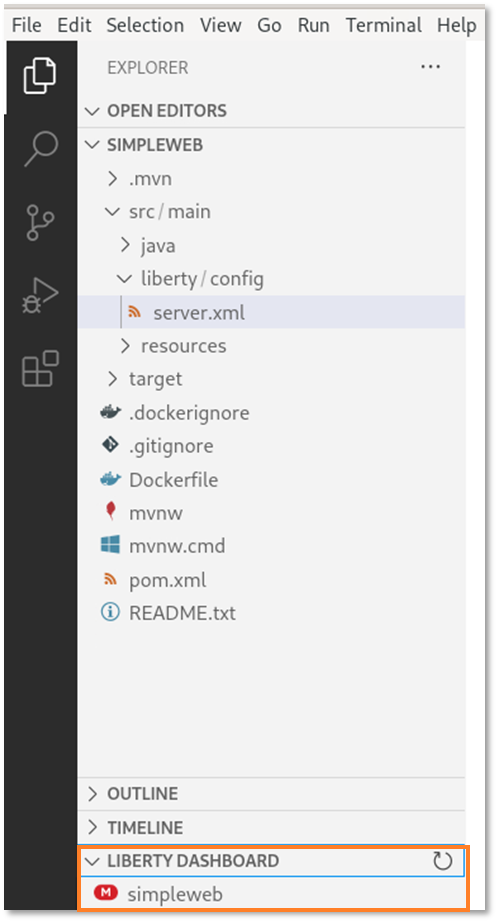</kbd>

2. Right-click on **simpleweb** and then **start** to start the server in dev mode.

    <kbd>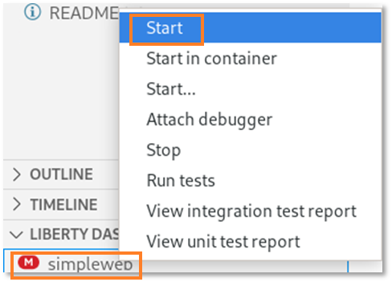</kbd>

3. A terminal opens within Visual Studio Code and you can see that the start of the build process gets triggered.

    <kbd>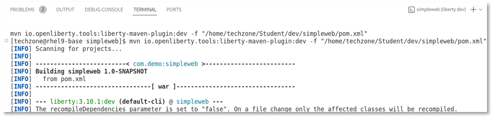</kbd>

4. The Liberty plugin as well as the Liberty server artifacts get downloaded, then the server is ready for testing.

    <kbd>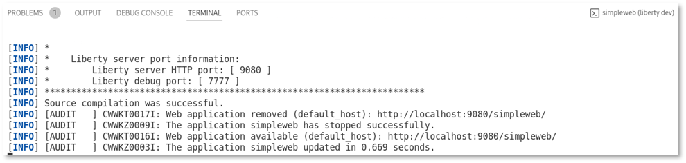</kbd>

5. Switch to the browser window and enter the URL “localhost:9080”. You should see something like this:

    <kbd>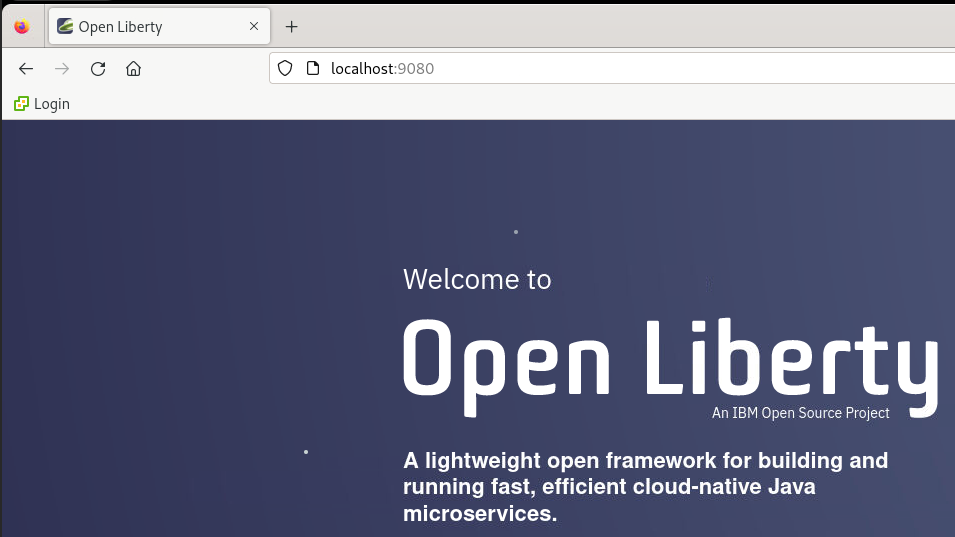</kbd>

    | <kbd></kbd> | If you get a pop-up with “Authentication required”, enter the password “IBMDem0s!” and click on “Unlock”. |

Now, let’s create a simple web application.

### 6.3.5 Create a simple web application

Now you will develop a simple web application which maiy consists of a servlet. Thanks to Liberty code assistant, you don't have to write the code on your own. 

1. Switch to Visual Studio Code.

2. In Visual Studio Code, expand the path to **src/main/java/com/demo/rest**, then **right-click** on **demo** and select **New File**.

    <kbd>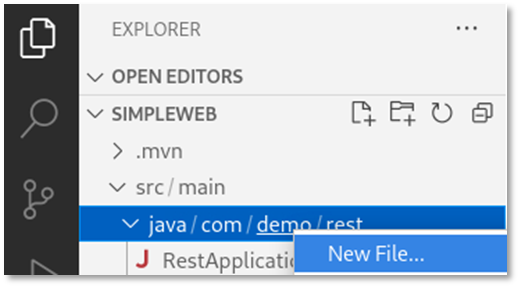</kbd>

3. Enter the name **helloWorldServlet.java** and press **ENTER**.

    <kbd>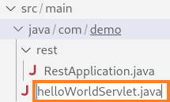</kbd>

4. The file **src/main/java/com/demo/helloWorldServlet.java** is generated and opens in an editor.

    <kbd>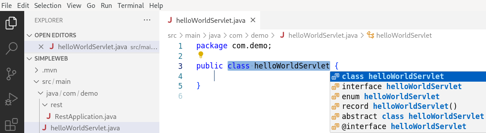</kbd>

5. Remove all code from the file. Then enter **servlet** and press **CTRL+SPACE**.

    <kbd>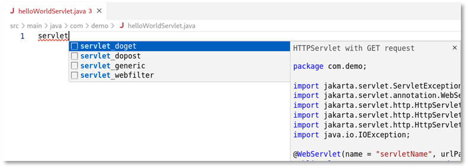</kbd>

6. The code assistant offers some servlet methods for Jakarta EE. Select **servlet_doget**, and the required starter code gets generated.
    As you can see, the fields that should be changed are highlighted.

    <kbd>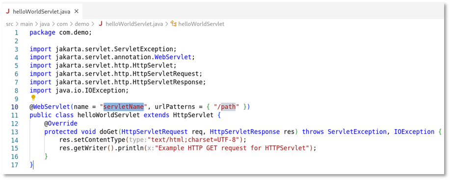</kbd>

7. Change the **servletName** to **helloWorldServlet** and the **urlPatters** to **/helloWorld**. The code should now look like this:

    <kbd>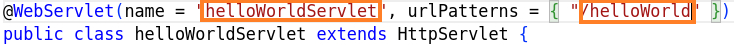</kbd>

8. Press **CTRL+S** to save the code change. Take a look at the terminal output. As Liberty has been started in DevMode, the code changes are picked up automatically, the source gets compiled and Liberty gets updated.

    <kbd></kbd>

9. Switch to the browser and open the URL **localhost:9080/simpleweb/helloWorld**. You should see the output of the created servlet.

    <kbd></kbd>

10. Switch back to Visual Studio Code and change the source code of the servlet response text to something like this:

    <kbd></kbd>

11. Save the changes and reload the page in the browser. The output should be updated.

    <kbd></kbd>

12. Switch back to Visual Studio Code and close the editor for the file **helloWorldServlet.java**.

Final step as developer is to export the developed application as WAR file so that it can be used in the next part of the lab.

### 6.3.6 Export the developed application as WAR file

Export the developed application so that it can be deployed to Liberty by the operations team.

The generated maven pom by default does not generate a WAR file as it uses a “looseApplication” approach to optimize the inner-loop development experience. (For more details, see https://github.com/OpenLiberty/ci.maven). To change the default build behaviour, you need to adjust the pom.xml file and configure the Liberty maven plugin to generate a WAR by setting the property: **<looseApplication>false</looseApplication>**.

1. Switch back to Visual Studio Code.

2. In the Liberty dashboard, **right-click** on the **simpleweb** application and select **Stop** (or use CTRL+C on the terminal window instead).

    <kbd></kbd>

3. Verify in the terminal that Liberty has been stopped.

    <kbd></kbd>

4. In Visual Studio Code, open the file **pom.xml** and add to the Liberty plugin configuration the lines:

    <configuration>
        <looseApplication>false</looseApplication>
    </configuration>

    <kbd></kbd>

 5. If you would start Liberty now again in Dev Mode, the property looseApplication would be ignored and you would see a warning like this:   
 
    <kbd></kbd>

    Therefore, you must start Liberty in run mode to generate the WAR file. This can be done by entering in the terminal window the command:
    
        mvn liberty:run

    <kbd></kbd>

    As you can see in the screenshot above, maven has built the file simpleweb.war and stored it at ~/Student/dev/simpleweb/target/simpleweb.war.

6. Scroll down and you can see that it has been installed into the directory ~/Student/simpleweb/target/liberty/wlp/usr/servers/defaultServer/apps.

    <kbd></kbd>

7. Feel free to test the application in the browser, then **stop the Liberty instance** by using **CTRL+C**.

8. Close Visual Studio Code.

### 6.3.7 Create a server package

For the next lab, you will need the WAR file as well as the server.xml which can be found in the created Liberty instance at: 
**~/Student/simpleweb/target/liberty/wlp/usr/servers/defaultServer**.
More complex applications also depend on other files like utility jars, additional Liberty configuration files and JDBC drivers for example. 
So instead of copying the files one by one, you could create a server package that contains all files.

What is a **server package**?
A server package can contain only the user directory or the full application server.  
The syntax of the server package command is: 

    server package server_name --archive=package_file_name.jar --include=all

With the option --include=all, the Liberty binaries as well as the usr directory get packaged.
For more details and options, see https://www.ibm.com/docs/en/was-liberty/base?topic=line-packaging-liberty-server-from-command.

1. To create the server package, execute the following command:

        ~/Student/dev/simpleweb/target/liberty/wlp/bin/server package defaultServer --archive=simpleweb-serverpackage.jar --include=all

    <kbd></kbd>

2. To hand over the server package to the ops team, use the following commands: 

        cp ~/Student/dev/simpleweb/target/liberty/wlp/usr/servers/defaultServer/simpleweb-serverpackage.jar ~/Student/assets

### 6.3.8 Recap

Congratulations, you have finished the application development part.

**Let’s recap what you did so far.** 

You acted as developer and used Visual Studio Code and the Liberty Tools for these tasks:
-   You generated a Liberty starter project including the required maven and Liberty configuration. 
-   You used the Liberty Tools configuration assistant to adjust the Liberty configuration.
-   You used Liberty Dev Mode for inner-loop development.
- 	You create a simple web application using the Jakarta EE code assistant. 
- 	You exported the web application as WAR file.
-	You created a server package including application and Liberty binaries.

Useful links: https://github.com/OpenLiberty/liberty-tools-vscode/blob/HEAD/docs/user-guide.md 

### 6.4 Liberty operations 

Now you will work with Liberty from an operational point of view. Development has handed over a server package to you. The server package contains all necessary configuration to run the application called **simpleweb**. The provided server package is typically not production-ready, as it is likely not portable between stages and does not fulfill the requirements regarding security and so on. 

In this part of the lab, you will explore how to create configuration snippets and how to administer Liberty from the command line. But first you will explore the server package and get an understanding about dynamic updates.

### 6.4.1 Explore the server package

You will now explore the Liberty server package to get a better understanding how to use it, in addition you will use it to learn more about **Liberty administration from the command line** and **Liberty dynamic updates**.

### 6.4.1.1 Liberty administration from the command line

1. Extract the Liberty server package and try to run it. When asked, enter **test** as target directory.

        cd ~/Student/ops/
        java -jar ~/Student/assets/simpleweb-serverpackage.jar

    <kbd></kbd>

    The directory test/wlp got created and contains the configured Liberty instance including application. 
    
2. Run the following command to **get the Liberty version**:

        test/wlp/bin/productInfo version

    <kbd></kbd>

3. Run the following command to **list the Liberty features** that have been installed:

        test/wlp/bin/productInfo featureInfo

    <kbd></kbd>

    As you can see, the server package provided by the developer only contains the servlet-6.0 features which is the only feature required by the application. 

4. Run the following command to get the **list of defined Liberty application servers**:

        test/wlp/bin/server list

    <kbd></kbd>

5. **Start the Liberty server instance** by running the command:

        test/wlp/bin/server start defaultServer
    
    <kbd></kbd>

    This runs the server in the background and the output is written to files in the test/wlp/bin/servers/defaultServer/logs directory.
    
    To start the server in the foreground (so the console messages are displayed in the command window) you would use the command 
    
        test/wlp/bin/server run defaultServer. 
        
    You will use it later in the lab.

6. View the Liberty server’s messages.log file to see the server startup messages via the command:

        cat test/wlp/usr/servers/defaultServer/logs/messages.log

    <kbd></kbd>
    
    At the beginning of the log, you can see that Open Liberty 24.0.0.2 is used.
    The server is started when the message **“The defaultServer server is ready to run a smarter planet”** is displayed in the messages.log file.

7. Test that the application is accessible via URL http://localhost:9080/simpleweb/helloWorld

    <kbd></kbd>

### 6.4.1.2 Liberty dynamic updates

Let’s do a short excurse about Liberty dynamic updates. You will use Visual Studio Code to perform some minor configuration changes. For this part of the lab, you could instead also use a simple text editor like vi or gedit instead. 

1. Open Visual Studio Code.

        cd ~/Student/ops/test
        code .

    <kbd></kbd>

2. Visual Studio Code opens. Click on **Yes**, if you are asked to trust the author.

    <kbd></kbd>

3. In Visual Studio Code, open a terminal window

    <kbd></kbd>

4. In the terminal, use the tail command to display the Liberty message log.

        tail -f wlp/usr/servers/defaultServer/logs/messages.log

    <kbd></kbd>

5. Wait until the web application has been initialized

    <kbd></kbd>

6. In Visual Studio Code, navigate to **wlp > usr > servers > defaultServer** and open the file **server.xml**.

    <kbd></kbd>

7. In the file server.xml, change the httpPort setting from port 9080 to port 9081

    <kbd></kbd>

    You can see in the terminal that the change is picked up and Liberty listens now on port 9081.

    <kbd></kbd>

8. Change the webApplication contextRoot setting from **“/simpleweb”** to **“/mysimpleweb”**.

    <kbd></kbd>

    You can see in the log that the change is picked up.

    <kbd></kbd>

9. Switch to the browser and access the application via URL **localhost:9081/mysimpleweb/helloWorld**.

    <kbd></kbd>

    As you have seen, you can change the Liberty configuration without having to restart the server. 
    You will explore this further later in the lab when you dynamically update the logging for example.
    Now let's stop the server.

10. In the terminal, press **CTRL+C** to stop the tail command. 

11. Stop the Liberty instance by executing in the terminal the command:

        wlp/bin/server stop defaultServer

    <kbd></kbd>

### 6.4.2 Create Liberty configuration snippets.

     
## 10. Cleanup

1.  **`Stop`** and **`remove`** the container. Then check that the container has been removed, by using the “**docker ps -a”** command

        docker stop modresorts
        
        docker rm modresorts
        
        docker ps -a | grep modresorts

2.  **`Remove`** the modresorts container image. Then use the “**docker images**” command to verify the image has been removed

        docker rmi modresorts:1.0

        docker images | grep modresorts

3.  Finally **`remove`** the **`Student's`** folder and the downloaded assets.

        cd ~
        rm -rf ~/Student
        rm ~/Downloads/*

4. Stop Transformation Advisor

        cd /home/techzone/transformation-advisor-local-3.9.0
        scripts/stopTransformationAdvisor.sh

5. Close the browser and all terminal windows

## Summary

In this lab, you learned how to evaluate the existing Java application
using IBM Cloud Transformation Advisor.

You learned how to use Transformation Advisors generated deployment
accelerators from the migration bundle to build and run an application
in Open Liberty in stand-alone mode on a VM and in containers.

As a part of IBM Application Modernization solutions, the Transformation
Advisor tool provides a recommendation for the right-fit IBM WebSphere
Application Server edition and offers advice, best practices, and
potential solutions to assess the ease of moving apps to Liberty or to
WAS container, or to newer versions of WebSphere traditional.

Transformation Advisor accelerates application migrating to Liberty and
containers and helps minimize errors and risks and reduce time to
market.

 

**Congratulations!**

**You have successfully completed the lab “Exploring IBM Transformation
Advisor data collection, app assessments, and deployment accelerators”**
